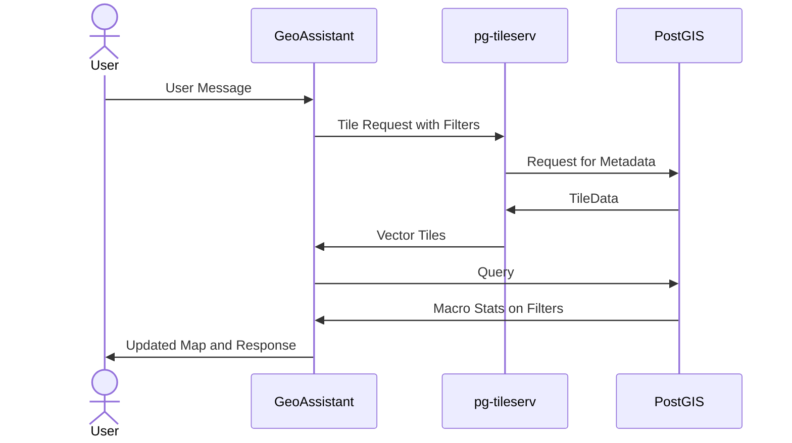
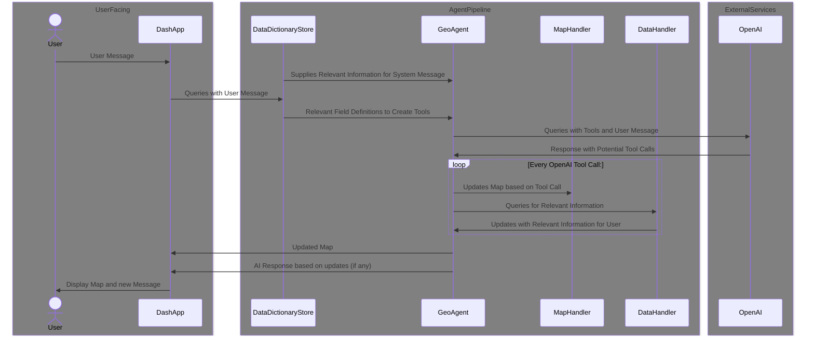

# System Architecture
This is a living document of the currently implemented architecture of GeoAssistant. Please update
this doc accordingly for any PR that changes it.

## Services

Three services are built / deployed via `docker-compose`

  1. PostGIS Database
  1. pg-tileserv Tile Server
  1. GeoAssistant Python Application

Below is a basic outline of how the services interact with each other

### PostGIS

This service is built via docker-compose, and lives within its own Docker Container

### pg-tileserv

This service is also built via docker-compose, and lives in its own container.

More information can be found on the [Github Page](https://github.com/CrunchyData/pg_tileserv) or [Official Documentation](https://access.crunchydata.com/documentation/pg_tileserv/latest/)

### GeoAssistant

This is the main application that carries the core logic. This application is split into several key components, including (not limited to for simplicity):
  - `DashApp`: Frontend application that accepts data from user, displays the map, and displays the chat log
  - `DataDictionaryStore`: Stores all the data parsed from a data dictionary (only supports pdfs for now), and creates a faiss index to search field definitions
  - `GeoAgent`: Holds the core logic for calling OpenAI SDK, routing tool calls, and managing messages
  - `MapHandler`: Manages the plotly map object by adding *layers* and updating the figured with those. Directly interacts with `pg-tileserv`
  - `DataHandler`: Wrapper class to easily query the PostGIS database

Below is a quick sequence diagram on how these systems interact

