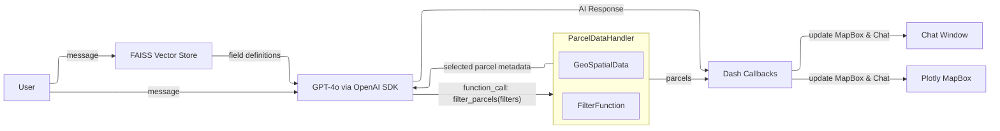

## Initial Project Proposal - LLM-Driven GeoData Explorer

### Stated Goal

To explore geospatial parcel data via a natural-language conversation. The LLM will:

1. Retrieve the most relevant field definitions from a vector store backed by a 100‑page data dictionary.
2. Generate structured filter calls to select parcels.
3. Update the map view (zoom, pan, and highlight) and reply in plain language.

---

### System Design & Workflow



---

### Vector Store

The vector store will hold all field definitions, including:

* **Field Name**
* **Description**
* **Type**

The combination of `field name` and `description` will be embedded for similarity search, while `type` and other attributes are stored as metadata associated with each definition.

The VectorStore class will also:

* Parse definitions from a PDF (using the OpenAI API).
* Automatically save and load the vector store with proper versioning.

---

### LLM Calls

The LLM will be guided by a system message like:

```text
You are a geo-assistant. You will converse with a user and decide which parcels to show based on the conversation.
You have access to a `filter_parcels` tool, where you can supply different fields and values based on user requests to filter the map appropriately.
```

For each user query, the top-K field definitions from the FAISS vector store will be injected into the function definition.

**Example:**

```text
User: "Show me parcels with R2 zoning in Brooklyn."
```

FAISS returns: `borough` and `zoningID`, which generates this callable function schema:

```json
[
  {
    "name": "filter_parcels",
    "description": "Return parcels matching the given field filters",
    "parameters": {
      "type": "object",
      "properties": {
        "filters": {
          "type": "object",
          "properties": {
            "borough": {"type":"string","description":"e.g. Manhattan, Brooklyn"},
            "zoningID": {"type":"string","description":"e.g. R2, C4"}
          },
          "required":["borough","zoningID"]
        }
      },
      "required":["filters"]
    }
  }
]
```

---

### ParcelDataHandler

`ParcelDataHandler` is a wrapper class around the original GeoDataFrame. It exposes a `filter_parcels` function that:

1. Applies the given filters to update the GeoDataFrame.
2. Triggers Dash callbacks to:

   * Zoom and pan the map to include all selected parcels.
   * Color or highlight the filtered parcels.
